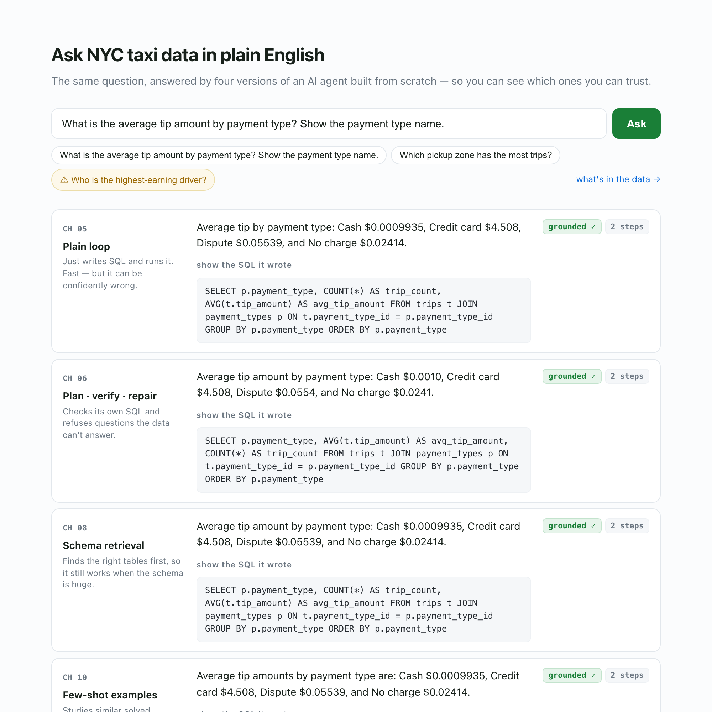
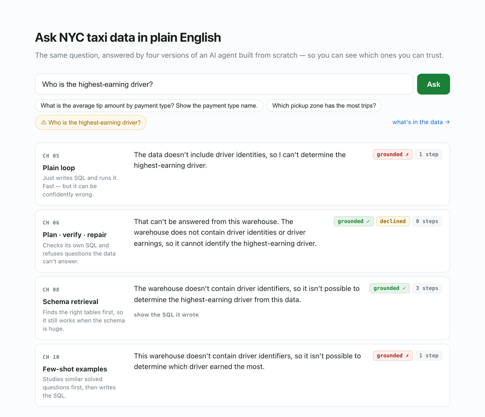

<div align="center">

# Data Agent From Scratch

### Build a text-to-SQL agent from the loop up.

Ask a question in plain English. The agent finds the relevant schema, plans a query, writes SQL, checks it, runs it against a real warehouse, and returns an answer.

**No agent framework. No hidden orchestration layer. No mocked database.**

[](https://www.python.org/)
[](https://duckdb.org/)
[](.github/workflows/ci.yml)
[](LICENSE)

### [Open the live demo](https://data-agent-live-demo.azurewebsites.net)

</div>

---

## What this project is

Data Agent From Scratch is an executable study of how a reliable data agent is built.

The repository starts with a normal LLM request and adds one capability at a time: structured output, schema grounding, tool calling, an agent loop, verification, SQL guardrails, retrieval, routing, memory, tracing, and embeddings.

The shared implementation lives in [`dataagent/`](dataagent/). Each stage remains runnable and inspectable in [`chapters/`](chapters/), so the architecture evolves without hiding the previous version behind a framework.

Text-to-SQL is useful here because most behavior is objectively testable. A generated query either produces the expected result from the warehouse or it does not.

### At a glance

| Area | What is implemented |
|---|---|
| Agent core | Tool-calling loop built without an agent framework |
| Reliability | Plan → verify → repair, grounded-answer checks, bounded execution |
| Data safety | Read-only DuckDB, SQL validation, row limits, query timeouts |
| Retrieval | BM25 from scratch, LSA from scratch, Sentence Transformers, API embeddings |
| Cost control | Question-shape routing between cheap and strong models |
| Context | Schema retrieval, few-shot retrieval, multi-turn conversation memory |
| Observability | Per-step traces, tokens, latency, cost, stop reason, grounded status |
| Providers | Ollama, Anthropic, OpenAI, Azure OpenAI |
| Evaluation | Golden SQL/result sets evaluated against the real warehouse |
| Demo | Cloud, local, and replay modes with the same comparison UI |

---

## See the agent change as the engineering changes

The demo runs the same question through three versions of the agent side by side: the plain loop, plan/verify/repair, and schema retrieval.

[](https://data-agent-live-demo.azurewebsites.net)

The receipts under each answer come from the tracing layer: steps, tokens, grounded status, stop reason, and cost when the provider reports it.

A useful failure case is a question the warehouse cannot actually answer. The taxi data contains vendor IDs, but no driver identities. The plain loop can still drift into a vendor-level answer; the verified agent checks the request against the available data and refuses the unsupported conclusion.

[](https://data-agent-live-demo.azurewebsites.net)

The hosted page can replay captured **real runs** without making a new model call. When a live backend is available, the same UI can call the cloud or local agent instead. The fallback is explicit rather than pretending a recorded response is live. See [`demo/`](demo/) for the implementation.

---

## The core idea

The centre of the project is deliberately small:

```python
while True:
    reply = model(messages, tools)
    messages.append(reply)

    if not reply.tool_calls:
        return reply.text

    for call in reply.tool_calls:
        result = execute(call)
        messages.append(result)
```

Everything else is engineering around that loop.

```text
                         question
                            │
                            ▼
                 ┌─────────────────────┐
                 │ schema / example    │
                 │ retrieval           │
                 └─────────┬───────────┘
                           │
                           ▼
                 ┌─────────────────────┐
                 │ provider gateway    │
                 │ local / hosted LLM  │
                 └─────────┬───────────┘
                           │
                           ▼
                 ┌─────────────────────┐
                 │ agent loop          │
                 │ think → act → see   │
                 └─────────┬───────────┘
                           │
                 ┌─────────▼───────────┐
                 │ plan / verify /     │
                 │ repair              │
                 └─────────┬───────────┘
                           │
                           ▼
                 ┌─────────────────────┐
                 │ SQL safety boundary │
                 │ + compute limits    │
                 └─────────┬───────────┘
                           │
                           ▼
                     ┌──────────┐
                     │ DuckDB   │
                     └────┬─────┘
                          │
                          ▼
                    traced answer
```

The model gateway is isolated in [`dataagent/llm.py`](dataagent/llm.py). Database access goes through [`dataagent/warehouse.py`](dataagent/warehouse.py). Retrieval lives behind [`dataagent/retrieval.py`](dataagent/retrieval.py) and [`dataagent/embeddings.py`](dataagent/embeddings.py).

That separation is intentional: swapping a model should not rewrite the database boundary, and swapping a retriever should not rewrite the agent loop.

---

## Database

The local warehouse is built by [`scripts/build_warehouse.py`](scripts/build_warehouse.py) from January 2024 [NYC Taxi & Limousine Commission trip data](https://www.nyc.gov/site/tlc/about/tlc-trip-record-data.page).

It contains **300,000 sampled taxi trips** plus two lookup tables:

```text
trips (300,000)
├── vendor_id
├── pickup_at
├── dropoff_at
├── passenger_count
├── trip_distance_miles
├── pickup_zone_id ─────────────┐
├── dropoff_zone_id ────────────┼──► zones (265)
├── payment_type_id ────────┐   │    ├── zone_id
├── fare_amount             │   │    ├── borough
├── tip_amount              │   │    ├── zone_name
├── tolls_amount            │   │    └── service_zone
└── total_amount            │   │
                            │   │
                            └──► payment_types (7)
                                 ├── payment_type_id
                                 └── payment_type
```

The joins are logical rather than declared foreign-key constraints. The agent has to understand the schema instead of relying on ORM relationship metadata.

The data is also deliberately imperfect. It includes NULLs, outliers, lookup mismatches, and values that are easy for a model to guess incorrectly. Those are exactly the cases a clean synthetic dataset would hide.

### Schema profiling

[`dataagent/warehouse.py`](dataagent/warehouse.py) introspects the database and enriches low-cardinality columns with real values before the schema reaches the model.

A column called `payment_type` does not tell a model whether the stored value is `Credit card`, `CREDIT CARD`, or `credit_card`. Supplying the actual enum-like values fixed an entire class of otherwise plausible SQL errors on the small local model.

---

## Measured behavior

The evaluation harness in [`evals/`](evals/) does not ask another LLM whether an answer looks correct. Golden questions carry SQL that recomputes the expected result from the warehouse.

### Verification

| Model | Plain loop | + plan · verify · repair | Change | Trap answers |
|---|---:|---:|---:|---:|
| `qwen2.5:3b` — local | 51% | **69%** | **+18 points** | 3 → **0** |
| Frontier model via Azure | 94% | **100%** | **+6 points** | 0 → 0 |

The larger improvement on the weaker model is the point: guardrails matter most when the model needs them.

### Retrieval

The schema-retrieval benchmark grows the catalog from **3 to 253 tables**. Lexical BM25 retrieval keeps text-to-SQL accuracy at **94%** on the reference model while avoiding a prompt containing the full catalog.

Chapter 13 then measures semantic retrieval on the same catalog. The from-scratch LSA baseline and BM25 score **62%** on the semantic retrieval set, while a pretrained Sentence Transformer reaches **92%**. The gap is useful evidence of what pretrained world knowledge buys when a schema does not contain the same words as the question.

### Routing

The routing chapter sends simple questions to a cheap/local tier and escalates questions whose shape predicts harder SQL. In the recorded benchmark, routing reaches **79%** while sending **47%** of calls to the paid strong model, compared with 51% for the cheap model alone and 94% for all-strong routing.

These are repository measurements, not claims that the same percentages will hold for every model or dataset. The point is that the alternatives share an evaluation surface and can be compared.

---

## Engineering techniques worth looking at

### 1. One database chokepoint

Every model-generated query passes through [`run_sql()`](dataagent/warehouse.py). The model never receives a raw DuckDB connection.

That gives the application one place to enforce:

- `SELECT` / `WITH` only
- one statement at a time
- blocked write and administration operations
- read-only database connections
- bounded result sizes
- bounded query compute

The compute timeout matters independently of a row limit. A huge aggregate can return one row after doing expensive work over millions of intermediate combinations. A watchdog interrupts DuckDB when the configured time budget is exceeded.

### 2. Retrieval is a seam, not a framework

[`dataagent/retrieval.py`](dataagent/retrieval.py) implements BM25 over table cards containing the table name, columns, and a short description.

```text
question → retrieve tables → render schema → agent
```

Because downstream code depends on that boundary rather than the scorer, Chapter 13 can replace lexical ranking with semantic ranking without replacing the rest of the agent.

### 3. Embeddings behind one interface

[`dataagent/embeddings.py`](dataagent/embeddings.py) exposes three strategies through the same interface:

| Strategy | Implementation | Network required |
|---|---|---|
| `lsa` | TF-IDF + truncated SVD built with [NumPy](https://numpy.org/) | No |
| `model` | [Sentence Transformers](https://www.sbert.net/) with `all-MiniLM-L6-v2` | No after download |
| `api` | OpenAI-compatible embedding endpoint | Yes |

All vectors are L2-normalized, so cosine similarity becomes a matrix dot product. The index code does not need to know which embedder produced the vectors.

### 4. Model routing based on question shape

[`dataagent/routing.py`](dataagent/routing.py) looks at the question, not the underlying rows, for signals correlated with harder queries: joins, ranked aggregates, minimum-count constraints, and related shapes.

The route includes its reasons. That makes model cost inspectable instead of hiding it behind a generic "smart routing" label.

### 5. Few-shot retrieval without evaluation leakage

[`dataagent/fewshot.py`](dataagent/fewshot.py) retrieves solved question/SQL examples, but the example library is kept separate from the golden evaluation set.

That sounds minor, but retrieving an evaluated question's own answer would measure memorization rather than generalization.

### 6. Tracing through an existing callback

[`dataagent/trace.py`](dataagent/trace.py) attaches to the loop through `on_step` rather than adding observability code to every branch of the agent.

The loop already maintains cumulative token/cost usage, so per-step accounting is calculated by diffing successive snapshots. One run becomes one JSONL record containing:

- provider and model
- tool calls and steps
- latency
- input/output tokens
- cost
- stop reason
- grounded status

JSONL keeps the result easy to grep, diff, replay, or load into a dataframe later.

### 7. A demo that degrades honestly

[`demo/index.html`](demo/index.html) uses the browser's [Fetch API](https://developer.mozilla.org/en-US/docs/Web/API/Fetch_API) to ask the local server which execution modes are available. If there is no backend, the page loads captured runs instead.

The three comparison columns execute concurrently with [`Promise.all()`](https://developer.mozilla.org/en-US/docs/Web/JavaScript/Reference/Global_Objects/Promise/all), so each result can appear as its agent finishes.

The UI is deliberately framework-free and uses standard browser features:

- [CSS Grid](https://developer.mozilla.org/en-US/docs/Web/CSS/CSS_grid_layout) for the three-column comparison
- [media queries](https://developer.mozilla.org/en-US/docs/Web/CSS/CSS_media_queries/Using_media_queries) for the mobile layout
- [`@keyframes`](https://developer.mozilla.org/en-US/docs/Web/CSS/@keyframes) for loading states
- [`aria-pressed`](https://developer.mozilla.org/en-US/docs/Web/Accessibility/ARIA/Reference/Attributes/aria-pressed) for accessible mode toggles
- [`fetch()`](https://developer.mozilla.org/en-US/docs/Web/API/Window/fetch) for the live/replay API boundary

The local server in [`demo/serve.py`](demo/serve.py) is also intentionally small: Python's `ThreadingHTTPServer` and `BaseHTTPRequestHandler`, with no Flask or FastAPI dependency.

---

## Technologies and libraries

The core dependencies are intentionally small. Optional provider and embedding packages stay optional in [`pyproject.toml`](pyproject.toml).

| Technology | Role |
|---|---|
| [Python](https://www.python.org/) 3.11+ | Agent, retrieval, evaluation, demo server |
| [DuckDB](https://duckdb.org/) | Embedded analytical warehouse and read-only query runtime |
| [Pydantic](https://docs.pydantic.dev/) | Typed boundaries and validation |
| [HTTPX](https://www.python-httpx.org/) | HTTP transport for provider integrations |
| [NumPy](https://numpy.org/) | TF-IDF/SVD embedding baseline and vector ranking |
| [Sentence Transformers](https://www.sbert.net/) | Optional local semantic embeddings |
| [Ollama](https://ollama.com/) | Local/offline LLM provider |
| [OpenAI Python](https://github.com/openai/openai-python) | OpenAI and Azure OpenAI compatible access |
| [Anthropic Python](https://github.com/anthropics/anthropic-sdk-python) | Optional Claude provider |
| [Rich](https://github.com/Textualize/rich) | Terminal output |
| [pytest](https://docs.pytest.org/) | Shared and chapter-level verification |
| [Ruff](https://docs.astral.sh/ruff/) | Linting and format checks |
| [GitHub Actions](https://docs.github.com/en/actions) | CI across supported Python versions |
| [Azure](https://azure.microsoft.com/) | Hosted model integration and demo deployment |

### Fonts used by the demo

The demo does **not** download a webfont. [`demo/index.html`](demo/index.html) uses native system stacks so there is no font request on page load.

The sans-serif stack includes [Segoe UI](https://learn.microsoft.com/en-us/typography/font-list/segoe-ui), [Roboto](https://fonts.google.com/specimen/Roboto), Helvetica, and Arial.

Code and trace output use the system monospace stack, including Apple's [SF Mono](https://developer.apple.com/fonts/), Menlo, and Microsoft's [Consolas](https://learn.microsoft.com/en-us/typography/font-list/consolas).

---

## Chapters

Each chapter adds one capability to the same system and keeps the change small enough to inspect.

| Chapter | Capability |
|---|---|
| 01 | First model call: messages, tokens, usage and cost |
| 02 | Structured output and retries |
| 03 | Database schema as model context |
| 04 | Tool calling and SQL execution |
| 05 | Agent loop from scratch |
| 06 | Plan, verify and repair |
| 07 | SQL and compute guardrails |
| 08 | BM25 schema retrieval over a 253-table catalog |
| 09 | Cheap/strong model routing |
| 10 | Retrieved few-shot examples |
| 11 | Multi-turn conversation memory |
| 12 | Step-level tracing and run receipts |
| 13 | LSA, pretrained and API embeddings |
| 14 | MCP: tools served from a separate process over JSON-RPC |
| 15 | MCP: connecting the agent to a server you didn't write |

The chapter implementations and their individual explanations live under [`chapters/`](chapters/).

---

## Project structure

```text
data-agent-from-scratch/
├── .github/
│   └── workflows/
│
├── assets/
│
├── chapters/
│   ├── 01_first_call/
│   ├── 02_structured_output/
│   ├── 03_schema_context/
│   ├── 04_tool_calling/
│   ├── 05_agent_loop/
│   ├── 06_plan_and_verify/
│   ├── 07_guardrails/
│   ├── 08_schema_retrieval/
│   ├── 09_routing/
│   ├── 10_few_shot/
│   ├── 11_conversation/
│   ├── 12_tracing/
│   ├── 13_embeddings/
│   ├── 14_mcp/
│   └── 15_mcp_connect/
│
├── dataagent/
├── demo/
│   └── data/
├── evals/
├── scripts/
├── tests/
│
├── data/                     # generated locally, not committed
│
├── .env.example
├── .gitignore
├── CONTRIBUTING.md
├── LICENSE
├── README.md
├── conftest.py
└── pyproject.toml
```

[`dataagent/`](dataagent/) contains the shared implementation: providers, database access, tools, retrieval, embeddings, routing, evaluation support, and tracing.

[`chapters/`](chapters/) is the learning path. Each directory isolates one architectural change so the difference from the previous version stays readable.

[`demo/`](demo/) contains the comparison interface, small Python server, deployment script, and captured runs used by replay mode.

[`evals/`](evals/) contains the golden evaluation cases. [`scripts/`](scripts/) contains repository-level utilities such as warehouse construction and evaluation runners. [`tests/`](tests/) covers the shared components while chapter-specific tests remain beside the code they verify.

`data/` is generated locally and contains the downloaded TLC sources and DuckDB warehouse. It is intentionally excluded from Git.

---

## CI

The workflow in [`.github/workflows/ci.yml`](.github/workflows/ci.yml) runs the project on Python **3.11, 3.12 and 3.13**.

CI installs the complete optional dependency set, caches the generated warehouse, runs Ruff lint and format checks, and then executes pytest.

No model API key is required for the test suite. Database behavior runs against the real DuckDB warehouse while provider-dependent behavior can use deterministic test doubles, which keeps pull requests testable from forks without exposing credentials.

---

## Contributing

Contributions are welcome, especially additions that preserve the project's main constraint: the behavior should stay understandable and measurable.

See [`CONTRIBUTING.md`](CONTRIBUTING.md) for the repository workflow.

## License

Released under the [MIT License](LICENSE).

The NYC TLC source dataset is provided separately by the New York City Taxi & Limousine Commission.
